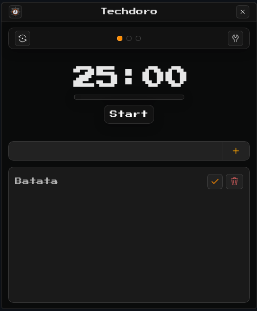

# Techdoro

<p align="center">
  
</p>

Techdoro é um timer Pomodoro desktop com lista de tarefas.

O projeto usa Tauri 2, SolidJS 1.9.15, Vite, Yarn e Biome.

## Desenvolvimento

Instale as dependências e execute o app Tauri:

```bash
make install
make dev
```

Para trabalhar apenas no frontend:

```bash
make web
```

Os mesmos comandos estão disponíveis via Yarn:

```bash
yarn install
yarn tauri:dev
```

## Arquitetura

O frontend fica diretamente em `src`, sem uma camada `renderer` intermediária:

- `src/app`: composição da aplicação e componentes compartilhados.
- `src/app/features`: módulos de settings, tarefas e timer, com estado e componentes próximos ao domínio.
- `src/app/services`: integrações com áudio, notificações e janela do Tauri.
- `src/assets`: fontes, sons e ícones usados pela aplicação.

## Qualidade e build

Execute as verificações:

```bash
make check
```

Formate os arquivos com Biome:

```bash
make format
```

Gere o build do frontend:

```bash
make build
```

Gere os instaladores Tauri para o sistema atual:

```bash
make tauri-build
```

## Releases e atualizações

O aplicativo verifica atualizações automaticamente ao iniciar uma versão publicada. Quando encontra uma versão mais recente, baixa, instala e reinicia o aplicativo.

O release é criado pelo GitHub Actions ao enviar uma tag no formato `v*`:

```bash
git tag -a v3.0.5 -m "Release v3.0.5: remove arredondamentos do frontend"
git push origin v3.0.5
```

As notas de cada release ficam em `.github/release-notes/vX.Y.Z.md`. Crie esse arquivo antes de enviar uma nova tag para que a página da release descreva as mudanças daquela versão.

Antes da primeira release, gere uma chave de assinatura e cadastre a chave privada como o secret `TAURI_SIGNING_PRIVATE_KEY` do repositório. A chave privada nunca deve ser versionada:

```bash
yarn tauri signer generate --ci --force -w tauri/key/techdoro.key
gh secret set TAURI_SIGNING_PRIVATE_KEY < tauri/key/techdoro.key
```

Se a chave for protegida por senha, cadastre também `TAURI_SIGNING_PRIVATE_KEY_PASSWORD`. Caso uma nova chave seja gerada, atualize o campo `plugins.updater.pubkey` em `tauri/tauri.conf.json` com o conteúdo do arquivo `.pub` correspondente.

O Tauri precisa das dependências nativas da plataforma. No Linux, instale WebKitGTK 4.1, GTK 3, libayatana-appindicator e as ferramentas de empacotamento recomendadas pela sua distribuição.

No Windows, o Tauri usa o Microsoft Edge WebView2 e as ferramentas C++ da Microsoft.

Fechar a janela pelo botão superior a oculta no tray. Use `Exit` no menu do tray para encerrar o aplicativo.

As configurações do timer, volume e tarefas continuam persistidas no `localStorage` do perfil do aplicativo.
